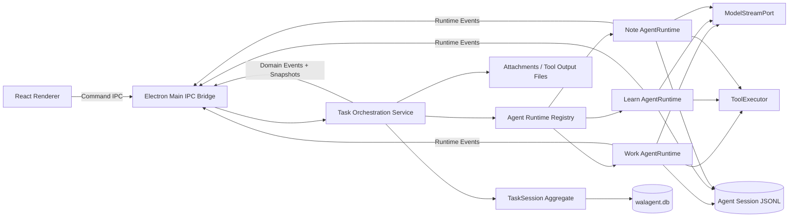
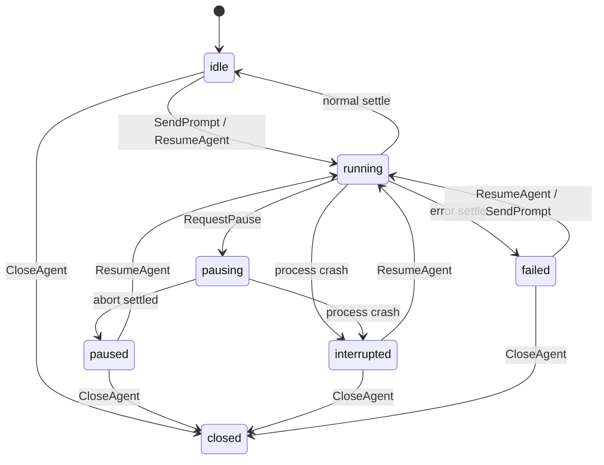

# Agent 编排架构

> 状态：目标架构草案，尚未实现。  
> 依据：WALAgent `README.md`；`D:\projects\pi` commit `8495f9d0d6407d4ec94e16a685df70740335dd29` 中的 Agent、AgentHarness、Session 和 supervisor 生命周期设计。  
> 核心判断：WALAgent 自建 L1 产品编排和单 Agent 生命周期；Pi 只作为设计参考，不作为运行时依赖或被适配的实现。

## 本文档范围

| 本文档负责 | 本文档不负责（见其他文档） |
|---|---|
| Task Session、Agent Thread、Agent Run、Briefing、Note 的编排边界 | 产品定位和阶段范围 → [`../../README.md`](../../README.md) |
| WAL 自建单 Agent 生命周期、turn、tool、queue、abort、settlement 和 recovery | 具体 UI 视觉与交互稿 → 后续 `docs/design/` |
| Work / Learn / Note 的状态机、并发规则和通信约束 | Provider 和密钥的最终选型 → 后续 `docs/contracts/` / `docs/architecture/` 专题 |
| Briefing 审批、幂等注入和持久化 owner | IPC 字段级 schema → 后续 `docs/contracts/` |
| P1 运行时 gate 和最小验收矩阵 | 具体实施步骤与提交拆分 → 后续 `docs/plan/` |

## 1. 结论

WALAgent 不采用“WAL L1 + Pi runtime adapter”的结构。目标状态由 WAL 自己拥有两层核心语义：

| 层 | Owner | 负责内容 | 不负责内容 |
|---|---|---|---|
| L1 产品编排 | `packages/core` | Task Session、角色线程、审批、注入、笔记、权限、恢复、对 UI 的 command/event | provider 协议细节和工具具体实现 |
| L2 Agent 生命周期 | `packages/agent-runtime` | 单 Agent turn loop、tool loop、流式事件、队列、turn snapshot、save point、compaction、abort 和 settlement | 定义 Work / Learn / Note 的产品协作语义 |
| Provider / Tool drivers | `packages/providers`、`packages/tools` 或主进程实现 | 调用具体模型 API、执行受控工具 | 持有产品状态机和 transcript 事实 |

P1 采用以下基线：

1. 每个 `AgentThread` 独占一个 WAL `AgentRuntime` 和一份 WAL Agent Session，原始 transcript 不共享。
2. `TaskSession` 是协作真相，但只保存任务状态、Agent 索引、Briefing、Note 和审计事件，不合并所有 Agent transcript。
3. Learn → Work 只通过已审批的结构化 `Briefing`；同 Agent 队列不作为跨 Agent 消息总线。
4. 用户看到的“暂停”是取消当前不可恢复运行、等待 settlement、保留 durable transcript 后进入 `paused`，不是冻结网络 stream 或外部进程。
5. WAL SQLite 保存产品元数据；WAL 自有 Agent Session JSONL 保存每个 Agent 的追加式生命周期和 transcript；附件和过长 tool result 使用文件对象存储。
6. Pi 的包、类型和事件不进入 WAL 的生产依赖、core contract 或 IPC contract。

## 2. 从 Pi 借鉴什么

Pi 的价值在于生命周期设计，而不是提供 WAL 的最终 runtime。

### 2.1 借鉴的生命周期原则

| Pi 设计 | WAL 采用方式 | WAL 的补充约束 |
|---|---|---|
| 显式 operation phase | runtime 使用 `idle / turn / compaction / retry / stopping` | phase 与产品层 `AgentThreadState` 分开 |
| 一个结构性操作一个 owner | 单 Agent 同时只运行一个 prompt、compaction 或恢复操作 | 拒绝并发结构性命令，不靠 UI 防重 |
| turn snapshot | 每次模型请求使用不可变的 model、prompt、tools、policy、context 快照 | 运行中配置变化只影响下一个 safe point |
| save point | assistant 和 tool result 完整落盘后刷新上下文、配置和队列 | pending writes 必须按确定顺序 flush |
| awaited settlement barrier | run 完成要等关键持久化和控制面 listener 完成 | 被动 observability listener 不得阻塞控制流 |
| steer / follow-up / next-turn 队列 | WAL 自建同 Agent 队列和 drain 规则 | 跨 Agent 只允许 Briefing / Note 等制品 |
| session 作为 durable agent state | Agent Session 日志保存 transcript、配置变化、compaction 和恢复记录 | Task Session 仍由 WAL SQLite 独立拥有 |
| conservative recovery | provider stream 不恢复；非幂等 tool 不自动重跑 | 启动时将未完成 run 标记为 `interrupted` |
| runtime owner 统一清理 | runtime registry 负责 abort、settle、close 和异常退出 | Electron 关闭必须走有界 shutdown |

### 2.2 不采用的部分

| Pi 模块或做法 | 结论 | 原因 |
|---|---|---|
| `@earendil-works/pi-agent-core` | 不作为 WAL runtime 依赖 | WAL 需要自己固定 lifecycle、durability 和 product contract |
| `pi-coding-agent` 的 `AgentSession` | 不依赖 | 包含 coding-agent 的 extensions、bash、UI、资源加载和 retry 语义，边界过宽 |
| `pi-server` | 不依赖 | experimental，且托管完整 coding-agent 子进程，不是 WAL 产品状态机 |
| Pi Session schema | 不直接复用 | WAL 需要自己的 entry version、Briefing 制品、run 审计和兼容策略 |
| Pi hook/event 类型 | 不暴露 | WAL 自己定义控制面 hook、domain event 和 runtime event |

如果后续参考 Pi 源码实现具体算法，必须基于许可证要求保留必要归属，并把复制范围限制在明确、可审查的实现切片；默认优先参考设计并独立实现。

## 3. 目标模块边界



建议的仓库边界：

```text
WALAgent/
  apps/desktop/                 # Electron 主进程、preload、React renderer
  packages/core/                # L1 domain + application + ports
  packages/agent-runtime/       # WAL 自建单 Agent 生命周期、loop、session、compaction
  packages/storage-local/       # WAL SQLite、Agent Session JSONL、附件、恢复协调
  packages/contracts/           # IPC command/event/snapshot schema
  packages/providers/           # 可选：模型 provider drivers
  packages/tools/               # 可选：角色工具和执行策略
```

`packages/core` 不依赖 Electron、React、SQLite、文件系统、provider SDK 或 Pi。`packages/agent-runtime` 只依赖 WAL 自己的 provider、tool、clock、id、session 等 port。

## 4. 领域模型

| 模型 | 关键字段 | Owner | 说明 |
|---|---|---|---|
| `TaskSession` | `id`、`taskId`、`workspaceRef`、`status`、`activeAgentId` | WAL SQLite | 一次 Work-and-Learn 协作的聚合根 |
| `AgentThread` | `id`、`taskSessionId`、`role`、`state`、`runtimeSessionRef` | WAL SQLite + Agent Session | 持久角色线程；一条线程对应一份隔离 transcript |
| `AgentRun` | `id`、`agentThreadId`、`reason`、`startedAt`、`settledAt`、`outcome` | WAL SQLite | 一次 prompt / resume 执行，不等同于线程生命周期 |
| `Briefing` | `id`、`sourceAgentId`、`targetAgentId`、结构化正文、`reviewStatus` | WAL SQLite | Learn 生成、用户审批的跨 Agent 制品 |
| `BriefingDelivery` | `id`、`briefingId`、`injectionKey`、`status`、`runtimeEntryRef` | WAL SQLite | 负责跨 SQLite / JSONL 的幂等投递 |
| `Note` | `id`、`taskSessionId`、`sourceAgentId`、标题、正文引用、标签 | WAL SQLite + 文件 | 面向用户的长期学习资产 |
| `OrchestrationEvent` | `id`、`taskSessionId`、`type`、安全 payload、时间戳 | WAL SQLite | 追加式审计和恢复依据 |

`AgentThread` 和 `AgentRun` 必须分开。线程保存长期上下文；run 记录一次执行的开始、结束、错误、暂停和恢复原因。

## 5. 两套状态必须分开

### 5.1 产品层 AgentThread 状态

| 状态 | 含义 | 可接受的主要命令 |
|---|---|---|
| `idle` | transcript 可继续，但当前没有运行 | `SendPrompt`、`CloseAgent` |
| `running` | runtime 正在执行一次 run | `RequestPause`、同 Agent `Steer` / `FollowUp` |
| `pausing` | 已发出 abort，等待 settlement 和 durable writes | 无新的结构性命令 |
| `paused` | 用户主动暂停，线程上下文保留 | `ResumeAgent`、`CloseAgent` |
| `interrupted` | App 异常退出时存在未完成 run | `ResumeAgent`、`CloseAgent` |
| `failed` | 最近一次 run 因 provider、tool 或控制面错误结束 | `ResumeAgent`、`SendPrompt`、`CloseAgent` |
| `closed` | 线程关闭，只读 | 无 |



### 5.2 runtime operation phase

```ts
type AgentRuntimePhase =
  | "idle"
  | "turn"
  | "compaction"
  | "retry"
  | "stopping";
```

phase 是进程内互斥和生命周期判断，不直接持久化为 UI 状态。产品层的 `running` 可能对应 runtime 的 `turn` 或 `retry`；产品层的 `pausing` 可能对应 runtime 的 `turn` 或 `stopping`。

结构性操作必须在第一个 `await` 前同步占有 phase，避免两个 command 同时通过 idle 检查。

## 6. 单 Agent 生命周期

### 6.1 Turn snapshot

每次 provider request 前生成不可变 `TurnSnapshot`：

```ts
interface TurnSnapshot {
  runId: string;
  sessionId: string;
  messages: AgentMessage[];
  systemPrompt: string;
  model: ModelRef;
  thinkingLevel: ThinkingLevel;
  tools: ToolDefinition[];
  toolPolicy: AgentToolPolicy;
  providerOptions: ProviderRequestOptions;
}
```

规则：

1. snapshot 创建后，当前 provider request 不再读取 live config。
2. 运行中修改 model、system prompt、tools、policy 或 resources，只影响下一个 safe point。
3. 凭据可以按请求动态解析，但不得写入 snapshot、session 或事件。
4. snapshot 构建失败时，run 进入失败 settlement，phase 必须恢复为 `idle`。

### 6.2 Turn 和 tool loop

一个 turn 是一次 assistant response 加其触发的全部 tool calls 和 tool results：

```text
turn_start
  -> provider request / message stream
  -> assistant message finalized
  -> tool preflight
  -> allowed tools execute
  -> tool results finalized
  -> turn_end
  -> save_point
```

tool call 的 preflight 必须在 assistant 消息 durable append 之后开始。这样权限检查、审计和崩溃恢复都能看到触发 tool 的原始 assistant message。

P1 默认 tool execution 为 sequential。只有工具明确声明可并行、无共享可变资源且结果顺序已定义时，才允许并行批次。

### 6.3 Save point

save point 位于完整 turn 之后，是 runtime 修改上下文和继续运行的唯一安全点：

1. assistant message 和 tool result 已落盘。
2. flush pending session writes，保持 agent-emitted entries 在前、控制面追加 entries 在后。
3. 处理 pause 请求。
4. drain steer queue；无 steer 时再 drain follow-up queue。
5. 判断 compaction、retry 或正常结束。
6. 若继续，重新创建 TurnSnapshot。

禁止在 provider stream 或 tool 执行中途替换当前 snapshot。

### 6.4 Settlement

`run_settled` 只有在以下条件都满足后才能发布：

1. 不再产生本 run 的 message / tool lifecycle event。
2. 最终 session entries 已 durable。
3. pending writes 已 flush 或明确记录失败。
4. 关键控制面 subscriber 已完成。
5. runtime phase 已恢复 `idle`。
6. WAL SQLite 中的 `AgentRun.outcome` 和 `AgentThread.state` 已提交。

被动 observability subscriber 的异常必须隔离，不能改变 run outcome。

## 7. 同 Agent 队列

| 队列 | 注入时机 | 典型用途 | abort 行为 |
|---|---|---|---|
| `steer` | 当前 turn 完整结束后的第一个 save point | 用户纠正同一 Agent 的方向 | 清空 |
| `followUp` | Agent 原本将结束、且无 steer 时 | 同一 Agent 后续工作 | 清空 |
| `nextTurn` | 下一次用户主动启动 run 前 | 暂停后需要保留的下一轮输入 | 保留 |

队列 mutation 成功返回前必须先 durable，或者明确标注为仅进程内、不承诺崩溃恢复。P1 建议 `nextTurn` durable，`steer` / `followUp` 在首个实现切片中也持久化，避免 UI 已显示“已排队”但崩溃后丢失。

Work / Learn 之间禁止使用这些队列通信。

## 8. 暂停不是冻结

provider stream、shell process 和外部 API 副作用通常不能从任意指令点恢复。因此：

1. `RequestPause` 先把 WAL 状态持久化为 `pausing`。
2. runtime 触发当前 run 的 `AbortController`，并请求 tool executor 停止可取消工作。
3. runtime 等待当前 producer、关键 listener 和 session writer settlement。
4. 已完成的消息和 tool result 保留；未完成 run 记录 `outcome = paused`。
5. WAL 持久化 `paused` 后再向 UI 发 `AgentPaused`。
6. `ResumeAgent` 创建新 run，并向同一 Agent Session 追加明确的 resume input package。

如果 tool 不支持取消或已经产生外部副作用，UI 必须显示其最终结果；不得把 `paused` 表述为“所有动作都已回滚”。

## 9. Task Session 并发规则

P1 建议采用保守规则：

| 规则 | P1 | 后续扩展 |
|---|---|---|
| 单个 AgentThread 同时运行的结构性操作 | 1 | 保持不变 |
| 单个 TaskSession 同时处于 `running` / `pausing` 的 Agent | 最多 1 个 | P2 可放开 Learn / Note 或多 Work 并行 |
| 不同 TaskSession 并发 | 允许 | 由全局资源和用户配置限流 |
| Work 运行时启动 Learn | 先暂停 Work | 后续可设计只读并行快照 |
| Briefing 注入 | 只在目标 Agent idle-like 状态执行 | 不修改 in-flight snapshot |

该规则让 P1 的 `activeAgentId`、工具副作用、Briefing 注入和 UI 焦点保持单一。

## 10. 上下文隔离与 Context Package

“上下文隔离”不等于 Learn 对任务一无所知。编排层给 Learn 生成受控 `ContextPackage`，而不是复制 Work transcript。

| 内容 | 默认是否进入 Learn | 来源 |
|---|---|---|
| Task 目标、验收标准、workspace 路径 | 是 | `TaskSession` |
| 用户当前问题 | 是 | 用户输入 |
| Work 的暂停原因和最近状态摘要 | 是 | WAL 运行记录 / 明确摘要 |
| 用户选中的文件、diff、错误日志 | 用户选择或策略允许 | workspace reader |
| Work 原始完整 transcript | 否 | - |
| Work 的隐藏 system prompt、密钥、provider payload | 否 | - |
| 尚未审批的其他 Learn 结论 | 否 | - |

Context Package 至少保存内容摘要、来源引用和创建时间；大文件正文只保存引用或 hash。

## 11. Briefing 协议与注入

### 11.1 状态拆分

| 对象 | 状态 |
|---|---|
| `Briefing.reviewStatus` | `draft`、`pending_approval`、`approved`、`rejected` |
| `BriefingDelivery.status` | `pending`、`delivering`、`delivered`、`failed` |

UI 可把 `approved + delivered` 显示为“已注入”，但持久化模型不混合审批和投递状态。

### 11.2 结构化内容

```ts
interface BriefingContent {
  title: string;
  conclusion: string;
  recommendations: Array<{
    action: string;
    rationale?: string;
  }>;
  references: Array<{
    kind: "file" | "symbol" | "message" | "note";
    value: string;
  }>;
  cautions: string[];
}
```

禁止把 Learn transcript 全文放进结构化字段逃避隔离规则。

### 11.3 幂等投递

WAL SQLite 和 Agent Session JSONL 不能共享数据库事务，投递使用唯一 `injectionKey`：

1. `ApproveBriefing` 在 WAL SQLite 事务内设置 `reviewStatus = approved`，并创建唯一 `BriefingDelivery`。
2. 目标 Agent 处于 idle-like 状态时开始投递。
3. session writer 查找 `context_artifact(kind = briefing, idempotencyKey)`。
4. 不存在时追加结构化 artifact entry，禁止追加 Learn 全文。
5. 回写 `runtimeEntryRef` 和 `status = delivered`。
6. 如果步骤 4 后、步骤 5 前崩溃，重启对账只补写 delivery 状态，不重复注入。

`ResumeAgent` 的顺序固定为：恢复未完成 delivery → 确认待注入 Briefing 已 delivered → 创建新 `AgentRun` → 发送 resume input package。

## 12. Runtime ports

`packages/agent-runtime` 面向能力 port，不面向 Pi API：

```ts
interface ModelStreamPort {
  stream(request: ModelRequest, signal: AbortSignal): AsyncIterable<ModelStreamEvent>;
}

interface ToolExecutor {
  execute(
    call: ToolCall,
    context: ToolExecutionContext,
    signal: AbortSignal,
  ): Promise<ToolExecutionResult>;
}

interface AgentSessionStore {
  append(entries: AgentSessionEntry[]): Promise<void>;
  readContext(sessionId: string): Promise<AgentSessionContext>;
  findArtifact(sessionId: string, idempotencyKey: string): Promise<SessionEntryRef | undefined>;
}
```

runtime 自己负责 loop、phase、snapshot、queue、event order 和 settlement。Provider driver 只负责把统一请求转换成供应商协议，并把供应商事件转换成统一 stream event。

## 13. Agent Session 日志

P1 的 Agent Session 是 WAL 自有、版本化、追加式 JSONL：

```text
{DataRoot}/
  walagent.db
  agent-sessions/
    {taskSessionId}/
      {agentThreadId}.jsonl
  attachments/
    {taskSessionId}/{artifactId}/...
  notes/
    {noteId}.md
```

建议 entry：

| entry type | 用途 |
|---|---|
| `session_header` | schema version、session id、agent id、role、workspace ref |
| `run_started` / `run_settled` | 单 Agent durable lifecycle |
| `message` | user、assistant、tool result 完整消息 |
| `tool_started` / `tool_settled` | 崩溃恢复和副作用审计 |
| `queue_enqueued` / `queue_consumed` | steer、follow-up、next-turn 的恢复 |
| `context_artifact` | approved Briefing、resume package、显式 task snapshot |
| `config_changed` | model、thinking、active tools、policy reference |
| `compaction` | context summary、保留边界和 usage |
| `operation_interrupted` | 启动恢复时标记未完成操作 |

session entry 必须有稳定 `id`、`seq`、`timestamp`、`runId`（适用时）和 schema version。P1 不实现 conversation branch tree；branching 有真实产品需求后再增加，避免把 Pi 的全部结构提前复制进来。

P1 不额外建立逐消息 SQLite 索引。UI transcript 通过 Agent Session store cursor 读取；只有实际性能证据出现后才增加索引或迁移存储实现。

## 14. 事件模型

| 类型 | 示例 | 是否持久化 | 用途 |
|---|---|---|---|
| Domain Event | `AgentPauseRequested`、`AgentPaused`、`BriefingApproved`、`BriefingDelivered` | 是 | 审计、恢复、状态投影 |
| Runtime Control Event | `turn_started`、`tool_settled`、`run_settled` | 是 | Agent Session lifecycle |
| Runtime Stream Event | `message_delta`、`tool_progress`、`provider_first_token` | 默认否 | UI 实时显示和诊断 |
| Observability Event | duration、usage、safe error class | 默认否或聚合 | 日志、指标、trace |

只有完整消息、run outcome、tool 最终结果引用和稳定错误分类进入 durable state。token delta 不写 WAL SQLite；renderer 重连后从快照和完整 transcript 恢复。

Runtime event 必须带 `taskSessionId`、`agentThreadId`、`agentRunId` 和单调递增 `sequence`。UI 发现 sequence 缺口时重新拉取 snapshot。

控制面 listener 可以影响执行，必须 await；observability listener 不能影响控制流，异常必须隔离。

## 15. 启动、恢复与关闭

### 15.1 启动恢复

1. 打开 WAL SQLite，执行 schema migration。
2. 校验 Agent Session header、schema version 和最后完整 JSONL 行；损坏的尾部 partial line 进入明确修复流程。
3. 扫描 `agent_threads.state IN (running, pausing)`，改为 `interrupted` 并追加恢复事件。
4. 扫描 Agent Session 中未完成的 run、provider request 和 tool call。
5. provider stream 不自动恢复。
6. 未完成 tool call 默认不重试；只有明确声明 idempotent / retry-safe 的工具才允许自动恢复。
7. 扫描 `BriefingDelivery.status IN (pending, delivering)`，按 `injectionKey` 对账。
8. readiness 只在数据库、session store、附件目录和 runtime factory 可用后成立。

### 15.2 关闭顺序

1. 停止接受新的结构性命令，UI 进入 closing 状态。
2. 对运行中的 Agent 请求 pause / abort。
3. 有界等待所有 runtime settle 和最终消息持久化。
4. flush WAL domain events、session entries 和 delivery 状态。
5. 关闭 session writer、SQLite、文件句柄、provider client 和 tool process。

清理错误必须聚合并记录，不能因为第一个 close 失败就跳过后续资源。

## 16. 角色与工具权限

| 角色 | 默认工具能力 | 强制限制 |
|---|---|---|
| Work | 读取 workspace、搜索、编辑、运行受控命令、生成 patch | 受 workspace scope、用户权限和高风险确认约束 |
| Learn | 读取选定文件、搜索、查看 diff / 日志 | 默认禁止编辑文件、执行有副作用命令和写入 Work transcript |
| Note | 读取 Context Package、Briefing、选定 transcript 片段；写 Note store | 禁止修改业务 workspace，禁止直接向 Work 注入内容 |

权限至少在两层执行：

1. TurnSnapshot 只包含 role-specific tools。
2. ToolExecutor 在执行前按 workspace、路径、命令风险和当前角色再次校验。

仅在 system prompt 中写“不要修改文件”不构成权限控制。

## 17. 错误分类和安全

| 分类 | 例子 | WAL 行为 |
|---|---|---|
| `provider_error` | 超时、限流、认证失败 | run → `failed`；错误脱敏；允许用户重试 |
| `tool_error` | 命令失败、文件不存在 | 保留 tool result；按 loop 规则决定是否继续 |
| `policy_blocked` | Learn 尝试写文件 | tool call 被阻止；记录低敏审计 |
| `storage_error` | SQLite / JSONL / attachment 写入失败 | 不发布成功 settlement；必要时阻止继续运行 |
| `runtime_interrupted` | App 崩溃、强制退出 | 启动时 thread → `interrupted` |
| `contract_error` | IPC payload 或 Briefing schema 无效 | 命令拒绝，不进入 runtime |

默认日志和事件不得包含 API key、Authorization header、完整 provider payload、完整 prompt、tool 参数中的秘密或用户文件正文。

## 18. P1 实施切片

| 切片 | 目标 | 完成证据 |
|---|---|---|
| 0. 生命周期契约测试 | 先用 faux model/tool port 固定 phase、snapshot、save point、queue、abort、settlement 语义 | 纯 runtime 自动测试；不调用真实模型 |
| 1. L1 core | 实现 TaskSession、AgentThread、AgentRun、Briefing/Delivery 命令和不变量 | 纯内存 TDD；非法转换测试 |
| 2. Agent runtime | 实现单 Agent loop、tool preflight、session writer 和 runtime events | faux provider / tool 测试 |
| 3. Local persistence | WAL SQLite、Agent Session JSONL、attachment store、启动 reconciliation | migration + 崩溃点集成测试 |
| 4. Runtime registry | 按 AgentThread 创建/释放 runtime，处理异常退出和 shutdown | 并发与 shutdown 测试 |
| 5. IPC contracts | command、snapshot、domain/runtime event schema | contract 测试；renderer 不导入 core internals |
| 6. Work/Learn/Briefing 主路径 | 暂停、提问、审批、幂等注入、恢复 | 端到端 faux provider 场景 |
| 7. Note path | Note Agent 和 Note store | 角色权限与持久化测试 |

结构性实现开始前，把每个切片扩展成 `docs/plan/` 下的可执行计划，并把稳定 payload 移入 `docs/contracts/`。

## 19. 最小验收矩阵

| 场景 | 必须证明 |
|---|---|
| phase 互斥 | 两个结构性命令不能同时通过 idle gate |
| turn snapshot | 运行中配置变化不影响当前 provider request，只影响下一个 save point |
| 上下文隔离 | Learn transcript 和未审批 Briefing 不出现在 Work provider context |
| 暂停 | settle 前不发布 `AgentPaused`；恢复后保留已完成 transcript |
| 注入 | 一个 `injectionKey` 最多产生一个 Briefing artifact entry |
| 崩溃恢复 | `running` / `pausing` 重启后变成 `interrupted`，不自动重跑非幂等 tool |
| 队列 | enqueue / consume 可恢复，abort 清理语义符合 contract |
| 工具权限 | Learn / Note 的写文件和副作用命令在执行层被阻止 |
| 事件顺序 | 同一 run 的 sequence 单调；UI 缺口可用 snapshot 恢复 |
| 存储失败 | JSONL 或 SQLite 写失败时，不把命令报告为成功 |
| 关闭 | active run 被有界终止，最终状态和错误可见，资源按顺序释放 |
| 安全 | 日志和 outward error 不包含密钥、认证头和完整敏感内容 |

## 20. 当前未决边界

以下问题不会改变“WAL 自建 L1 和 Agent 生命周期、Pi 仅作参考”的 owner：

1. 首个 LLM Provider、认证方式和统一 stream contract。
2. Work workspace 的授权、sandbox 和高风险命令确认策略。
3. P1 是否接受“单 TaskSession 最多一个 active Agent”的保守并发策略。
4. Agent Session JSONL 的 schema、fsync 策略和尾部损坏修复规则。
5. transcript 达到多大体量后增加 SQLite message index 或更换存储实现。
6. Note 正文首期存 SQLite TEXT 还是 `.md` 文件。
7. P1 是否实现 auto retry 和 compaction，还是先只保留 phase / contract。

在这些边界确认前，可以先实现生命周期契约测试和纯 core 状态机；不得先把 UI 组件或 Electron IPC 作为状态真相。
